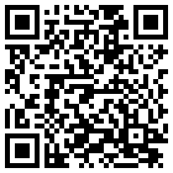
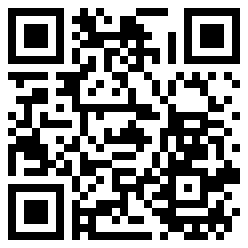
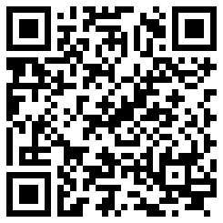

# DSAG Technologie Tage 2024 Hamburg

This repository provides the code behind the **Terraform demo** for the session **V090: Infrastructure as code in der SAP Business Technology Platform und erste Kundenerfahrungen von Freudenberg** (see [event page](https://dsagtechtage.plazz.net/)).

## The Terraform scripts

The Terraform scripts are split into two folders:

- [sap_build_apps](sap_build_apps): this folder contains the main Terraform script to setup the SAP Build Apps used in the demo. The script is using some additional resources, that are in the [modules](modules) folder.
- [modules](modules): this folder contains modules used by the [sap_build_apps](sap_build_apps script).

## Start today

Get started with a tutorial

Try out sample use cases

Read the documentation

